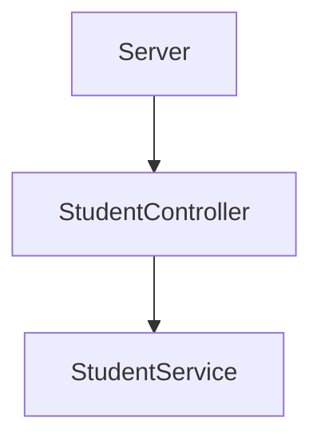
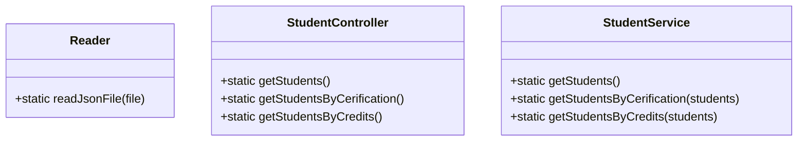

# API Rest Visual Partner Ship para mission NodeJs de Launch X

## Requerimientos y descripcion del proyecto: 
Visual Partner-Ship te ha asignado el siguiente proyecto:

### Cursos de Visual Thinking API
DB en formato JSON de los estudiantes de Visual Partner-Ship: https://gist.github.com/carlogilmar/1f5164637fb77aecef3b9e6b9e2a9b63

```marqdawn
1. Habilitar un endpoint para consultar todos los estudiantes con todos sus campos.
2. Habilitar un endpoint para consultar los emails de todos los estudiantes que tengan certificación haveCertification.
3. Habilitar un endpoint para consultar todos los estudiantes que tengan credits mayor a 500.
```

## Diseño de componentes
Se diseñaron 4 componentes principales para la funcionalidad del proyecto los cuales constan de:

* server: Script para montar el servidor con Express Server y creacion de endpoints necesarios para el proyecto.
* Reader: Script para leer la informacion de los estudiantes de Visual Partner-Ship en formato JSON utilizando el módulo File System de Node.js.
* StudentController: Script para conectar la funcionalidad con el servicio StudentService.
* StudentService: En este servicio se realizan todas las operaciones de filtrado y mapeo que se necesitan.


### Clases utilizadas para La consulta de la informacion de los estudiantes: 


## Reader
* readJsonFile(): Recibe la direccion del archivo de tipo JSON y regresa los datos en un objeto.
```javascript
    static readJsonFile(path){
        const rawdata = fs.readFileSync(path);
        return JSON.parse(rawdata);
    }
```
## StudentService
* getStudents() : Utilizando el metodo readJsonFile obtiene los estudiantes pertenecientes a Visual Partner Ship y retorna la informacion
```javascript
    static getStudents() {
        const students = Reader.readJsonFile("visualpartners.json");
        return students;
    }
```
* getStudentsByCerification(students): Obtiene los correos de los estudiantes que cuentan con certificacion en base a la lista de estudiantes registrados.
```javascript
    static getStudentsByCerification(students){
        const studentsByCertification = students.filter((student) => student.haveCertification == true);
        const mailsOfStudents = studentsByCertification.map((student) => student.email);
        return mailsOfStudents;
    }
```
* getStudentsByCredits(students): Obtiene todos los estudiantes los cuales tienen creditos mayor a 500 en base a la lista de estudiantes registrados.
```javascript
    static getStudentsByCredits(students){
        const StudentsByCredits = students.filter((student)=> student.credits > 500);
        return StudentsByCredits;
    }
```
## StudentController.
* getStudents(): Consume el metodo getStudents de la clase StudentService el cual retorna todos los estudiantes registrados.
```javascript
    static getStudents() {
        return StudentService.getStudents();
    }
```
* getStudentsByCerification(): Consume el metodo getStudentsByCerification de la clase StudentService el cual retorna los emails de los estudiantes registrados que cuentan con certificacion.
```javascript
    static getStudentsByCerification() {
        const students = Reader.readJsonFile("visualpartners.json");
        return StudentService.getStudentsByCerification(students);
    }
```
* getStudentsByCredits():Consume el metodo getStudentsByCredits de la clase StudentService el cual retorna los estudiantes registrados que cuentan con creditos mayor a 500.
```javascript
    static getStudentsByCredits(){
        const students = Reader.readJsonFile("visualpartners.json");
        return StudentService.getStudentsByCredits(students);
    }
```
## Server
Script para montar el servidor con Express Server y creacion de endpoints necesarios para el proyecto.

### End points
- */v1/students* : Lista la informacion de los estudiantes.
- */v1/studentsCertificated* : Lista los correos de los alumnos con certificacion.
- */v1/studentsWithCredits* : Lista los alumnos que tengan mas de 500 creditos.

## Ejemplo de consulta desde el navegador utilizando los endpoints configurados


## Herramientas y dependencias utilizadas en el proyecto
### Jest : Framework utilizado para realizar pruebas de funcionalidad, se realizaron las pruebas a los scripts utilizados en el proyecto.
* Ejemplos de test realizados:
```javascript
    test("Requerimiento 1 consultar todos los estudiantes con todos sus campos", ()=>{
        const students = StudentService.getStudents();
        expect(students[0]).toHaveProperty("haveCertification");
        expect(students[0]).toHaveProperty("name");
        expect(students[0]).toHaveProperty("email");
        expect(students[0]).toHaveProperty("credits");
        expect(students.length).toBeGreaterThan(0);
    });
    test("Requerimiento 2 consultar los emails de todos los estudiantes que tengan certificación", ()=>{
        const mailsOfStudents = StudentService.getStudentsByCerification(students);
        expect(mailsOfStudents.length).toBeGreaterThan(0);
        expect(mailsOfStudents).toContain("Todd@visualpartnership.xyz");
    });
    test("Requerimiento 3 consultar todos los estudiantes que tengan credits mayor a 500", ()=>{
        const StudentsByCredits = StudentService.getStudentsByCredits(students);
        expect(StudentsByCredits[0].name).toContain("Warren");
        expect(StudentsByCredits[0].credits).toBe(508);
        expect(StudentsByCredits[0].enrollments).toContain("Visual Thinking Intermedio");
    });
```
### EsLint: Herramienta para comprobación de errores de sintaxis y prevencion de errores.
* Configuracion utilizada:
```javascript
    "env": {
        "browser": true,
        "commonjs": true,
        "es2021": true,
        "jest": true
    },
    "extends": "eslint:recommended",
    "parserOptions": {
        "ecmaVersion": "latest"
    },
    "rules": {
        indent: ["error", 4],
        "linebreak-style": ["error", "unix"],
        quotes: ["error", "double"],
        semi: ["error", "always"]
    }
```
### Express Server: Framework utilizado para montar el servidor utilizado para el consumo de las apis generadas.
* Configuracion inicial realizada:
```javascript
const express = require("Express");
const app = express();
app.use(express.json());
const port = 3000;

app.get("/", (req, res) => {
    res.json({ message: "Welcome to Visual Partner-Ship" });
});

app.listen(port, () => {
    console.log(` Visual Partner-Ship API in localhost: ${port}`);
});
```
### Github Workflows: Utilizado para automatizacion de pruebas con Jest en github actions.
* Configuracion realizada:
```yml
name: Run Tests in my project every push on GitHub

on: [push, pull_request]

jobs:
  build:
    runs-on: ubuntu-latest
    steps:
    - uses: actions/checkout@v1
    - name: Run Jest
      uses: stefanoeb/jest-action@1.0.3
```
* Captura GitHub Actions:<br>


